# NextGen Studio — Project Architecture

---

## Table of Contents

1. [Problem Statement](#1-problem-statement)
2. [Solution Space](#2-solution-space)
3. [High-Level System Architecture](#3-high-level-system-architecture)
4. [Microservices Breakdown](#4-microservices-breakdown)
5. [AI Code Generation Flow](#5-ai-code-generation-flow)
6. [Preview Lifecycle](#6-preview-lifecycle)
7. [Entity-Relationship Diagram](#7-entity-relationship-diagram)
8. [Class Diagrams](#8-class-diagrams)
9. [Sequence Diagrams](#9-sequence-diagrams)
10. [Infrastructure & Deployment](#10-infrastructure--deployment)
11. [Feature Surface Map](#11-feature-surface-map)

---

## 1. Problem Statement

Building and shipping a web application today requires expertise across multiple disciplines: UI design, frontend frameworks, backend APIs, database modelling, cloud deployment, and CI/CD pipelines. The barrier is especially high for non-engineers and early-stage founders who have a clear product vision but lack the technical depth to execute it.

Existing low-code tools sacrifice flexibility; traditional development is slow and expensive. There is no middle ground that gives a technical-enough output (real, editable source code) while keeping the interaction as simple as a conversation.

**Key pain points:**
- High time-to-first-working-prototype for non-engineers
- No real-time, iterative AI pair-programmer that operates on a persistent project codebase
- No integrated preview environment — users must set up their own toolchain to see results
- Context loss: AI chat tools forget file state between sessions

---

## 2. Solution Space

NextGen Studio is an AI-powered full-stack application builder. Users describe what they want in natural language; the system generates, stores, and live-previews a real React/Vite codebase — iteratively, across sessions.

**Core design decisions:**

| Decision | Choice | Rationale |
|---|---|---|
| LLM access pattern | Tool-use (list_files, get_file_content) | LLM reads the real file tree, preventing hallucination of non-existent files |
| Session context | Last 10 messages + RAG similarity search | Balances token cost vs. full history; RAG surfaces relevant past code |
| File storage | MinIO object storage | S3-compatible, self-hosted, cost-efficient for binary and text assets |
| Code execution | Kubernetes pod per project namespace | Full isolation; supports any Node.js/Vite stack without a sandbox escape risk |
| Streaming | Server-Sent Events (SSE) | One-directional stream from server to browser; lower overhead than WebSockets for LLM token streaming |
| API routing | Spring Cloud Gateway | Centralised auth, rate limiting, and distributed tracing entry point |
| Embeddings DB | Qdrant Vector DB | Fast ANN search on code chunk embeddings for RAG |

---

## 3. High-Level System Architecture

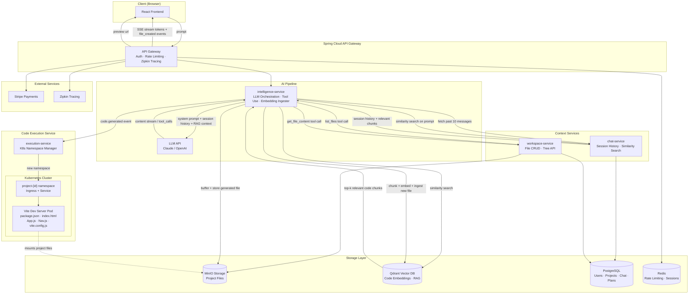

---

## 4. Microservices Breakdown

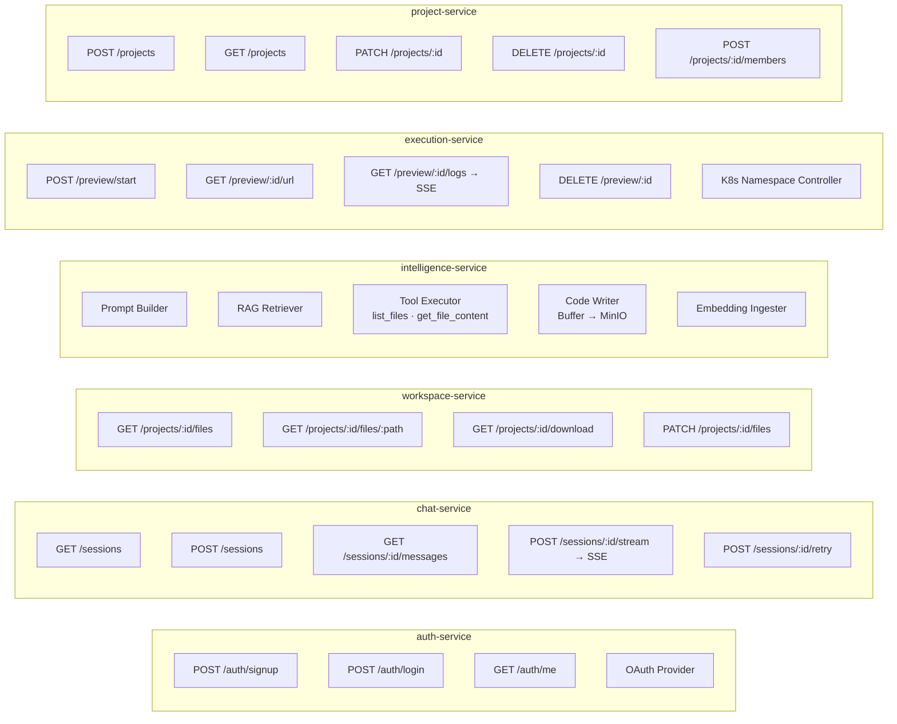

### Responsibility Matrix

| Service | Owns DB Tables | Reads from | Emits Events |
|---|---|---|---|
| auth-service | USER, SUBSCRIPTION, PLAN, USER_LOG | — | user.created, subscription.updated |
| chat-service | CHAT_SESSION, CHAT_MESSAGE | PROJECT | message.created |
| workspace-service | PROJECT_FILE | PROJECT | file.updated, file.created |
| intelligence-service | — | All (via APIs) | code.generated |
| execution-service | PREVIEW | PROJECT_FILE (MinIO) | preview.started, preview.terminated |
| project-service | PROJECT, PROJECT_MEMBER | USER | project.created |

---

## 5. AI Code Generation Flow

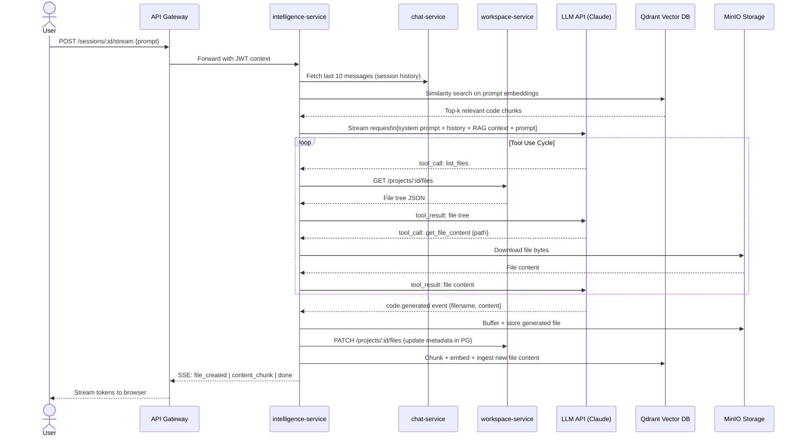

**System Prompt Strategy:**

The system prompt instructs the LLM to:
1. Always use `list_files` before writing to understand the existing project structure
2. Use `get_file_content` to read files before modifying them
3. Return changes as structured `code.generated` events (filename + full content)
4. Preserve existing code that is not related to the request
5. Generate idiomatic React + Vite + Tailwind code by default

---

## 6. Preview Lifecycle

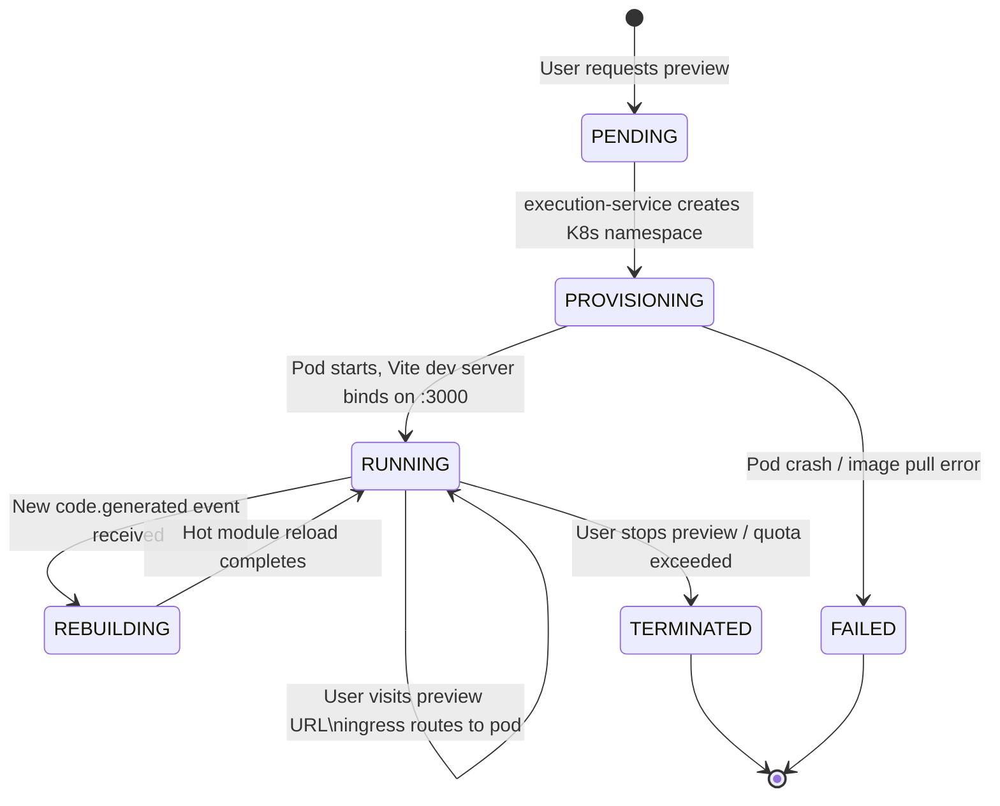

```mermaid
graph LR
    subgraph K8s Namespace per Project
        SVC[Service\nport 80 → 3000]
        POD[Pod\nWebContainer / Node.js image]
        PVC[Mounted MinIO\nproject files]
    end

    ING[Ingress\nproject-456.preview.app] --> SVC
    SVC --> POD
    POD --- PVC

    EXEC[execution-service] -->|create namespace| K8s Namespace per Project
    EXEC -->|watch events| POD
    EXEC -->|stream logs| USER
```

**Preview URL pattern:** `https://project-{id}.preview.yourdomain.com`

Each namespace isolates network, filesystem, and process space. The execution-service watches pod events and streams logs back to the frontend via a dedicated SSE endpoint.

---

## 7. Entity-Relationship Diagram

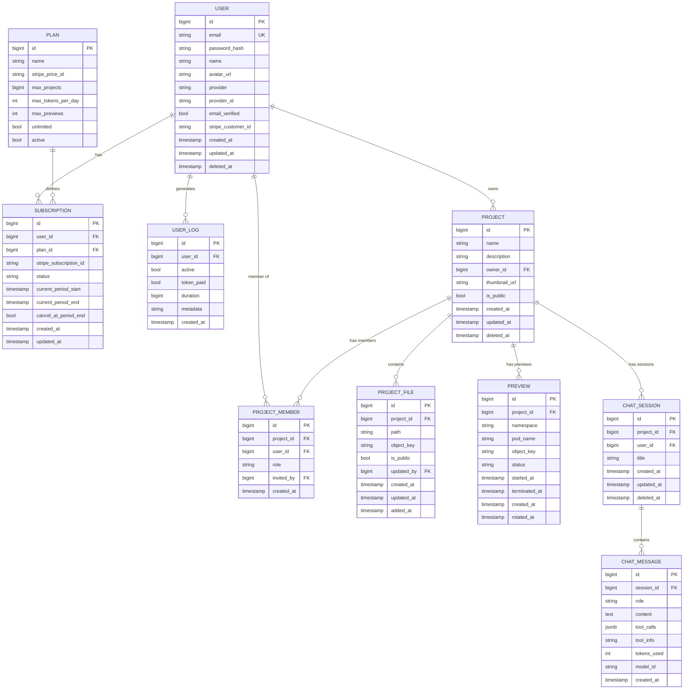

---

## 8. Class Diagrams

### 8.1 Domain Model — Core Entities

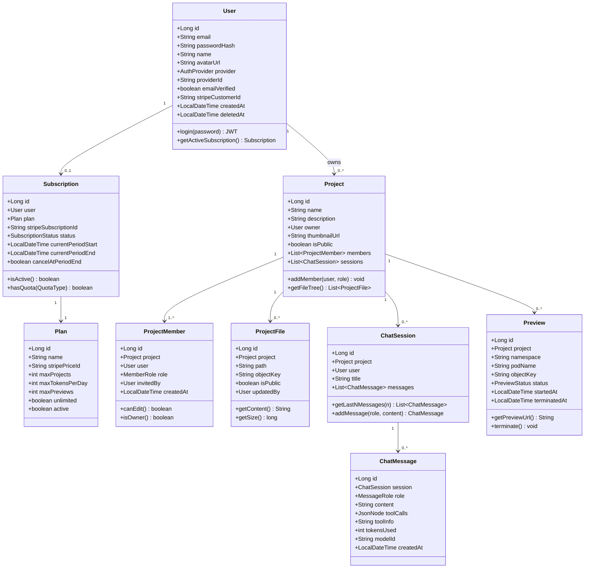

### 8.2 Intelligence Service — AI Pipeline

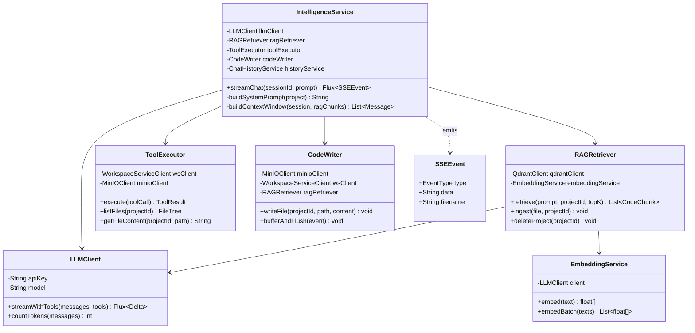

### 8.3 Execution Service — Kubernetes Controller

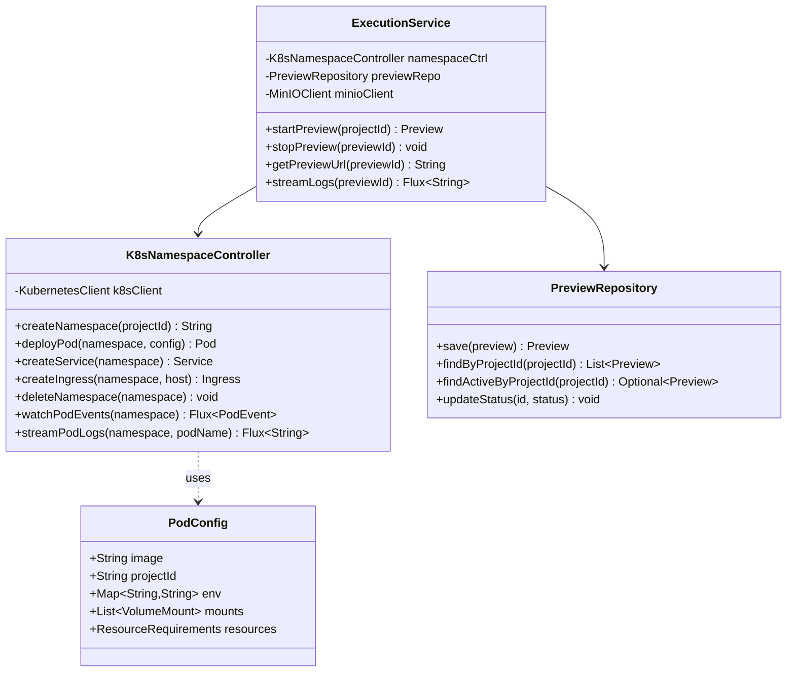

---

## 9. Sequence Diagrams

### 9.1 User Registration & Auth

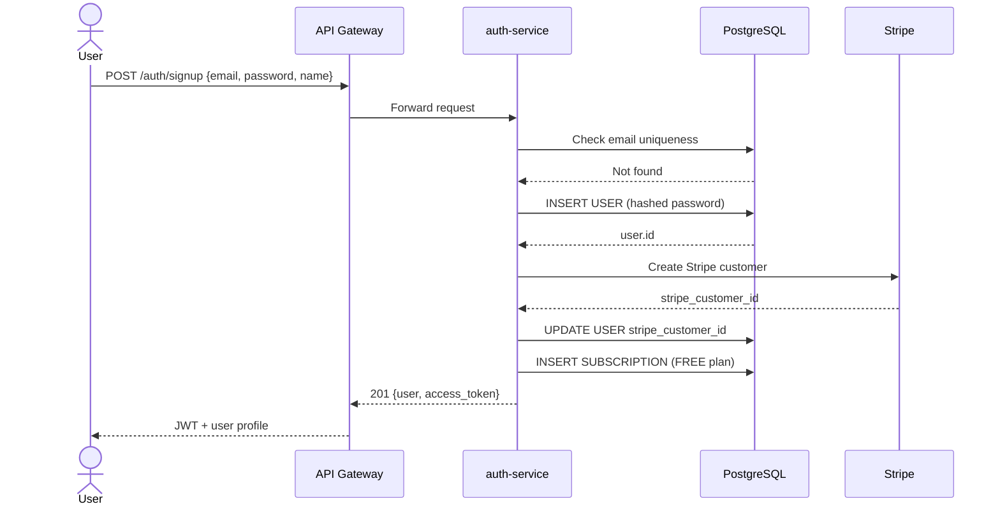

### 9.2 Chat Stream with Code Generation

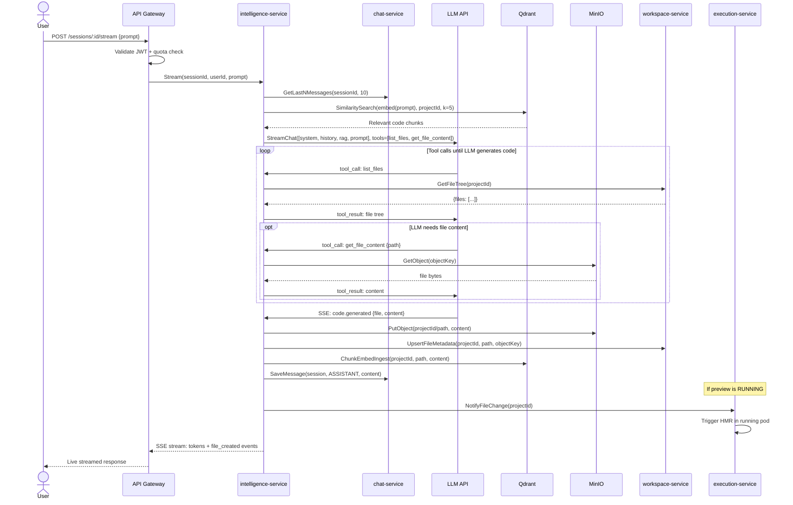

### 9.3 Preview Start

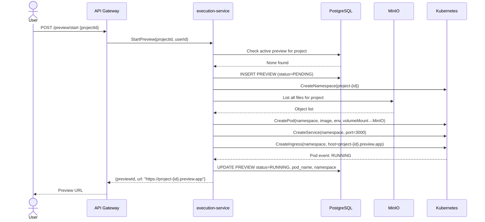

---

## 10. Infrastructure & Deployment

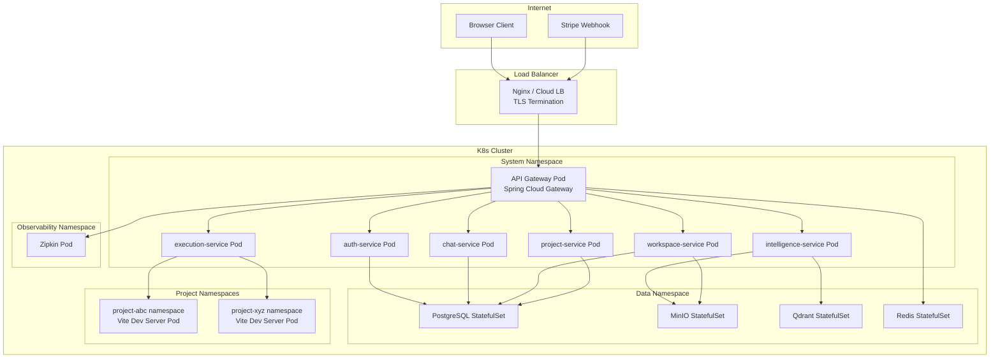

### Technology Stack Summary

| Layer | Technology |
|---|---|
| Frontend | React 18, Vite, TailwindCSS, TypeScript |
| API Gateway | Spring Cloud Gateway |
| Backend Services | Spring Boot 3 (Java 21) |
| LLM | Claude 3.5 Sonnet / Claude 4 (Anthropic API) |
| Vector DB | Qdrant |
| Relational DB | PostgreSQL 16 |
| Object Storage | MinIO (S3-compatible) |
| Cache / Rate Limit | Redis 7 |
| Container Runtime | Kubernetes (K3s / EKS / GKE) |
| Preview Runtime | Node.js 20 Alpine + Vite |
| Payments | Stripe |
| Tracing | Zipkin |
| Streaming | SSE (Server-Sent Events) |

---

## 11. Feature Surface Map

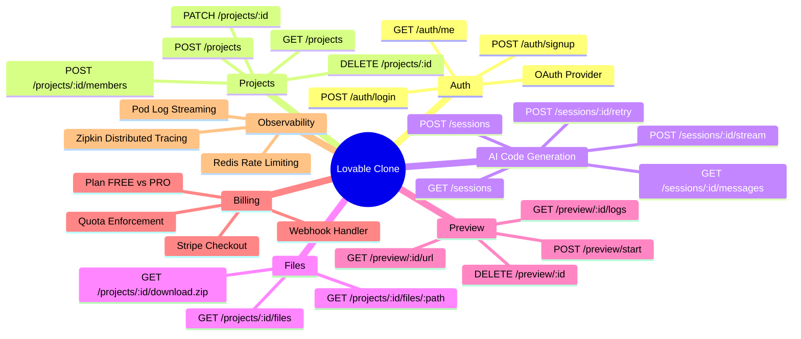

### Quota Rules

| Quota | FREE | PRO |
|---|---|---|
| Max Projects | 3 | Unlimited |
| Tokens / day | 50,000 | 2,000,000 |
| Concurrent Previews | 1 | 5 |
| Team Members per Project | 1 (owner only) | 10 |
| File Download (zip) | Yes | Yes |

---

*Last updated: 2026-05-24*
