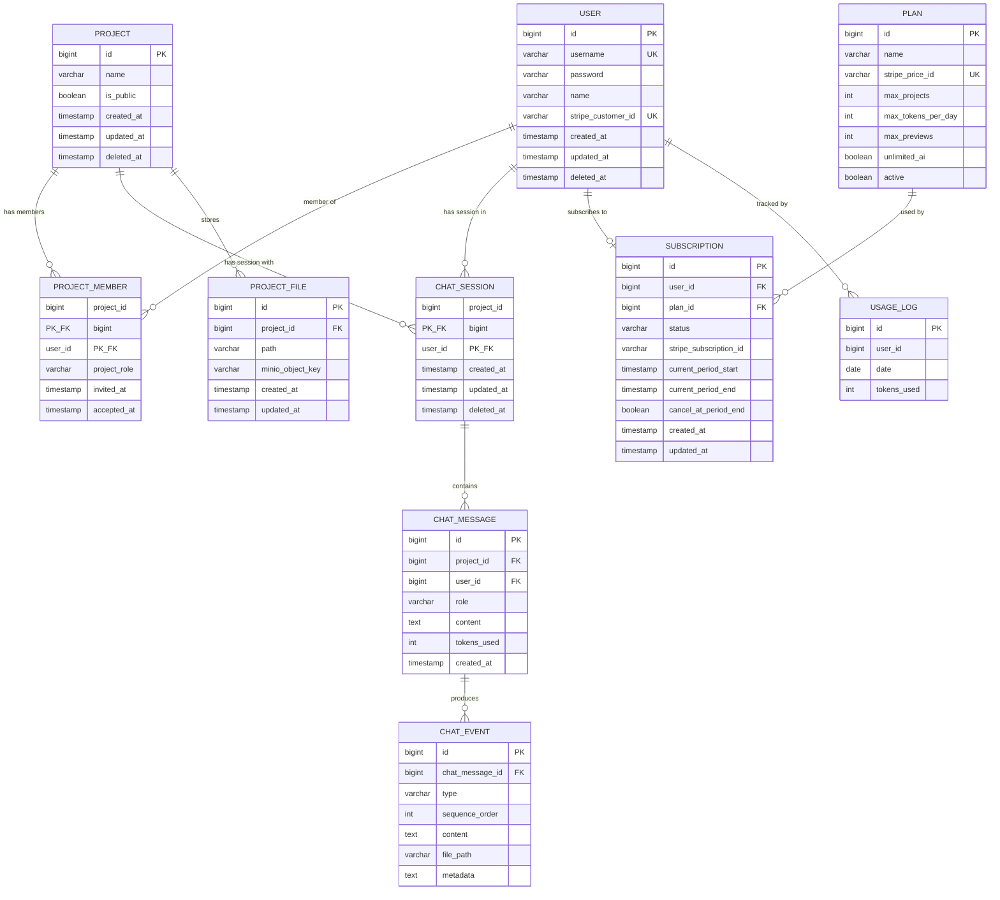
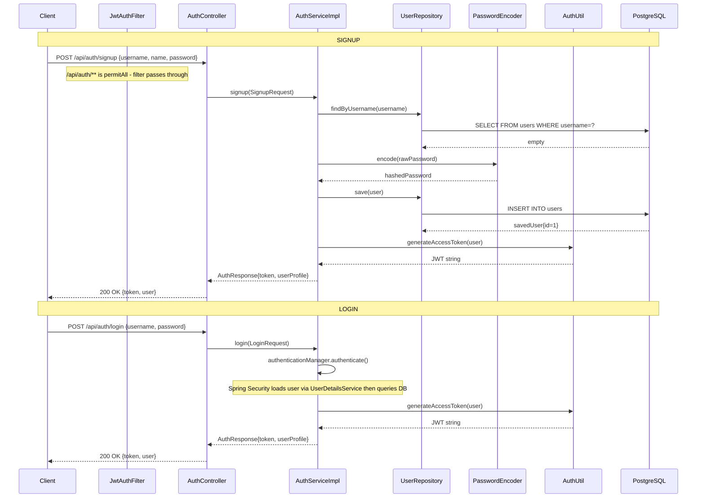
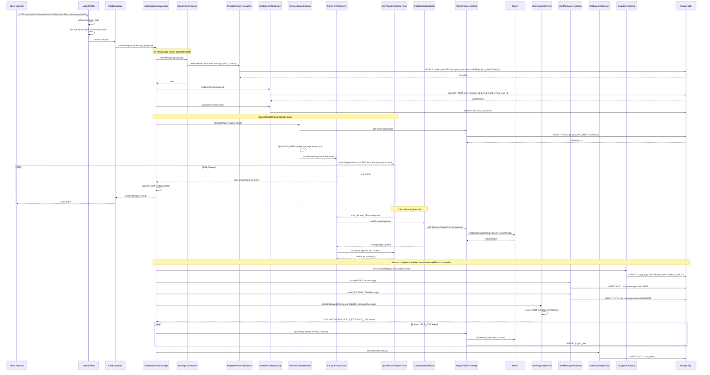
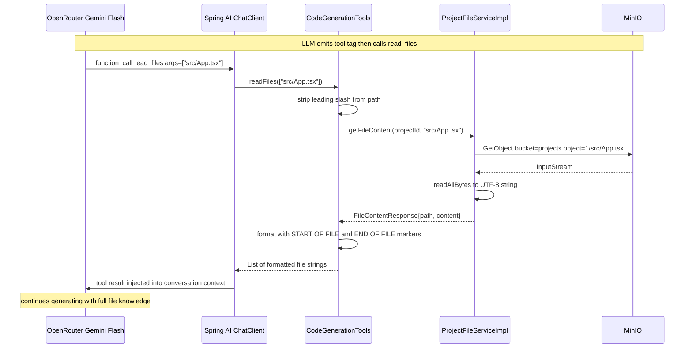
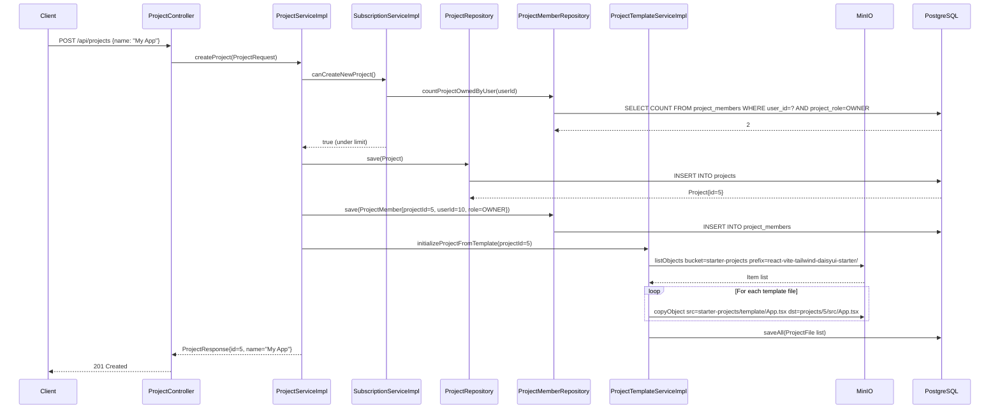
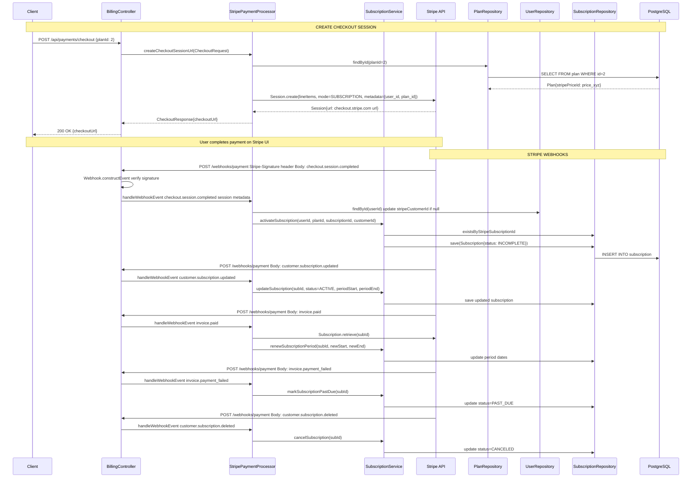

# MorphCode — Complete Architecture

## Table of Contents
1. [System Overview](#system-overview)
2. [Entity Relationship Diagram](#entity-relationship-diagram)
3. [Class Diagram](#class-diagram)
4. [Sequence Diagrams](#sequence-diagrams)
   - [Authentication Flow](#1-authentication-flow)
   - [AI Chat Stream Flow](#2-ai-chat-stream-flow)
   - [File Read Tool Call Flow](#3-file-read-tool-call-flow)
   - [Project Creation Flow](#4-project-creation-flow)
   - [Billing & Stripe Webhook Flow](#5-billing--stripe-webhook-flow)
5. [Application Flow — Detailed Explanation](#application-flow--detailed-explanation)
   - [Where Everything Starts](#where-everything-starts)
   - [Request Lifecycle](#request-lifecycle)
   - [Security Layer](#security-layer)
   - [AI Generation Pipeline](#ai-generation-pipeline)
   - [Storage Layer](#storage-layer)
   - [Billing Layer](#billing-layer)
   - [Where Everything Ends](#where-everything-ends)
6. [Component Responsibility Map](#component-responsibility-map)

---

## System Overview

MorphCode is a browser-based React IDE backend. Users create projects seeded from a React 18 + TypeScript + Vite + Tailwind + daisyUI template stored in MinIO. They chat with an LLM (OpenRouter → Gemini Flash via Spring AI) to edit files. The LLM reads the file tree and file contents via a tool call, writes files back to MinIO, and the response streams to the client via SSE.

```
Browser ──→ Spring Boot (port 8082)
              ├── JWT Auth (JJWT)
              ├── REST + SSE Controllers
              ├── Spring AI → OpenRouter → Gemini Flash
              ├── PostgreSQL (port 9010, db: pgvector-test)
              └── MinIO (port 9000)
```

---

## Entity Relationship Diagram



> **Composite Keys:**
> - `PROJECT_MEMBER` uses `(project_id, user_id)` as an `@Embeddable` composite PK (`ProjectMemberId`).
> - `CHAT_SESSION` uses `(project_id, user_id)` as a composite PK (`ChatSessionId` — missing `@Embeddable` annotation, known bug).

---

## Class Diagram

```mermaid
classDiagram

    %% ── Controllers ──────────────────────────────────────────
    class AuthController {
        -AuthService authService
        -UserService userService
        +signup(SignupRequest) ResponseEntity
        +login(LoginRequest) ResponseEntity
        +getProfile() ResponseEntity
    }

    class ChatController {
        -AiGenerationService aiGenerationService
        -ChatService chatService
        +streamChat(ChatRequest) Flux
        +getChatHistory(projectId) ResponseEntity
    }

    class ProjectController {
        -ProjectService projectService
        +getMyProjects() ResponseEntity
        +getProjectById(id) ResponseEntity
        +createProject(ProjectRequest) ResponseEntity
        +updateProject(id, ProjectRequest) ResponseEntity
        +deleteProject(id) ResponseEntity
    }

    class ProjectMemberController {
        -ProjectMemberService projectMemberService
        +getProjectMembers(projectId) ResponseEntity
        +inviteMember(projectId, InviteMemberRequest) ResponseEntity
        +updateMemberRole(projectId, memberId, req) ResponseEntity
        +removeMember(projectId, memberId) ResponseEntity
    }

    class FileController {
        -ProjectFileService projectFileService
        +getFileTree(projectId) ResponseEntity
        +getFile(projectId, path) ResponseEntity
    }

    class BillingController {
        -PlanService planService
        -SubscriptionService subscriptionService
        -PaymentProcessor paymentProcessor
        +getAllPlans() ResponseEntity
        +getMySubscription() ResponseEntity
        +createCheckoutSession(CheckoutRequest) ResponseEntity
        +openCustomerPortal() ResponseEntity
        +handlePaymentWebhooks(payload, sig) ResponseEntity
    }

    %% ── Services ──────────────────────────────────────────────
    class AiGenerationServiceImpl {
        -ChatClient chatClient
        -AuthUtil authUtil
        -ProjectFileService projectFileService
        -FileTreeContextAdvisor fileTreeContextAdvisor
        -LlmResponseParser llmResponseParser
        -UsageService usageService
        +streamResponse(message, projectId) Flux
        -finalizeChats(userMsg, session, fullText, duration, usage)
        -createChatSessionIfNotExists(projectId, userId) ChatSession
    }

    class AuthServiceImpl {
        -UserRepository userRepository
        -UserMapper userMapper
        -PasswordEncoder passwordEncoder
        -AuthUtil authUtil
        -AuthenticationManager authenticationManager
        +signup(SignupRequest) AuthResponse
        +login(LoginRequest) AuthResponse
    }

    class ProjectServiceImpl {
        -ProjectRepository projectRepository
        -UserRepository userRepository
        -ProjectMapper projectMapper
        -ProjectMemberRepository memberRepository
        -AuthUtil authUtil
        -SubscriptionService subscriptionService
        -ProjectTemplateService templateService
        +createProject(ProjectRequest) ProjectResponse
        +getUserProjects() List
        +getUserProjectById(id) ProjectSummaryResponse
        +updateProject(id, req) ProjectResponse
        +softDelete(id)
    }

    class ProjectMemberServiceImpl {
        -ProjectMemberRepository memberRepository
        -ProjectRepository projectRepository
        -ProjectMemberMapper mapper
        -UserRepository userRepository
        -AuthUtil authUtil
        +getProjectMembers(projectId) List
        +inviteMember(projectId, req) MemberResponse
        +updateMemberRole(projectId, memberId, req) MemberResponse
        +removeProjectMember(projectId, memberId)
    }

    class ProjectFileServiceImpl {
        -ProjectRepository projectRepository
        -ProjectFileRepository fileRepository
        -MinioClient minioClient
        -ProjectFileMapper mapper
        +getFileTree(projectId) FileTreeResponse
        +getFileContent(projectId, path) FileContentResponse
        +saveFile(projectId, path, content)
    }

    class ProjectTemplateServiceImpl {
        -MinioClient minioClient
        -ProjectFileRepository fileRepository
        -ProjectRepository projectRepository
        +initializeProjectFromTemplate(projectId)
    }

    class ChatServiceImpl {
        -ChatMessageRepository messageRepository
        -ChatSessionRepository sessionRepository
        -AuthUtil authUtil
        -ChatMapper chatMapper
        +getProjectChatHistory(projectId) List
    }

    class SubscriptionServiceImpl {
        -AuthUtil authUtil
        -SubscriptionRepository subscriptionRepository
        -SubscriptionMapper mapper
        -UserRepository userRepository
        -PlanRepository planRepository
        -ProjectMemberRepository memberRepository
        +getCurrentSubscription() SubscriptionResponse
        +activateSubscription(userId, planId, subId, custId)
        +updateSubscription(gatewayId, status, ...)
        +cancelSubscription(gatewayId)
        +renewSubscriptionPeriod(gatewayId, start, end)
        +markSubscriptionPastDue(gatewayId)
        +canCreateNewProject() boolean
    }

    class UsageServiceImpl {
        -UsageLogRepository usageLogRepository
        -AuthUtil authUtil
        -SubscriptionService subscriptionService
        +recordTokenUsage(userId, tokens)
        +checkDailyTokensUsage()
    }

    class StripePaymentProcessor {
        -AuthUtil authUtil
        -PlanRepository planRepository
        -UserRepository userRepository
        -SubscriptionService subscriptionService
        +createCheckoutSessionUrl(CheckoutRequest) CheckoutResponse
        +openCustomerPortal() PortalResponse
        +handleWebhookEvent(type, stripeObject, metadata)
    }

    %% ── Security ──────────────────────────────────────────────
    class AuthUtil {
        -String jwtSecretKey
        +generateAccessToken(User) String
        +verifyAccessToken(token) JwtUserPrincipal
        +getCurrentUserId() Long
    }

    class JwtAuthFilter {
        -AuthUtil authUtil
        -HandlerExceptionResolver resolver
        +doFilterInternal(req, res, chain)
    }

    class SecurityExpressions {
        -ProjectMemberRepository memberRepository
        -AuthUtil authUtil
        +canViewProject(projectId) boolean
        +canEditProject(projectId) boolean
        +canDeleteProject(projectId) boolean
        +canViewMembers(projectId) boolean
        +canManageMembers(projectId) boolean
    }

    %% ── LLM ──────────────────────────────────────────────────
    class LlmResponseParser {
        +parseChatEvents(fullResponse, parentMessage) List
        -extractAttributes(attrString) Map
    }

    class FileTreeContextAdvisor {
        -ProjectFileService projectFileService
        +adviseStream(request, chain) Flux
    }

    class CodeGenerationTools {
        -ProjectFileService projectFileService
        -Long projectId
        +readFiles(paths) List
    }

    %% ── Relationships ─────────────────────────────────────────
    AuthController --> AuthServiceImpl
    ChatController --> AiGenerationServiceImpl
    ChatController --> ChatServiceImpl
    ProjectController --> ProjectServiceImpl
    ProjectMemberController --> ProjectMemberServiceImpl
    FileController --> ProjectFileServiceImpl
    BillingController --> StripePaymentProcessor
    BillingController --> SubscriptionServiceImpl

    AiGenerationServiceImpl --> FileTreeContextAdvisor
    AiGenerationServiceImpl --> CodeGenerationTools
    AiGenerationServiceImpl --> LlmResponseParser
    AiGenerationServiceImpl --> ProjectFileServiceImpl
    AiGenerationServiceImpl --> UsageServiceImpl
    AiGenerationServiceImpl --> AuthUtil

    ProjectServiceImpl --> SubscriptionServiceImpl
    ProjectServiceImpl --> ProjectTemplateServiceImpl
    ProjectServiceImpl --> AuthUtil

    FileTreeContextAdvisor --> ProjectFileServiceImpl
    CodeGenerationTools --> ProjectFileServiceImpl

    StripePaymentProcessor --> SubscriptionServiceImpl

    JwtAuthFilter --> AuthUtil
    SecurityExpressions --> AuthUtil
```



---

## Sequence Diagrams

### 1. Authentication Flow



---

### 2. AI Chat Stream Flow



---

### 3. File Read Tool Call Flow



---

### 4. Project Creation Flow



---

### 5. Billing & Stripe Webhook Flow



---

## Application Flow — Detailed Explanation

### Where Everything Starts

**Entry point:** `MorphcodeApplication.java`

Spring Boot bootstraps the application on **port 8082**. During startup in this order:

1. **`StorageConfig`** creates a `MinioClient` bean pointing to `minio.endpoint` (port 9000).
2. **`AiConfig`** creates a `ChatClient` bean backed by OpenRouter (Spring AI's OpenAI-compatible adapter). A `SimpleLoggerAdvisor` is attached by default for debug logging.
3. **`WebSecurityConfig`** builds the security filter chain: CSRF disabled, CORS enabled via `CorsConfig`, stateless sessions, and `JwtAuthFilter` inserted before `UsernamePasswordAuthenticationFilter`.
4. **`PaymentConfig`** calls `Stripe.apiKey = ...` to initialise the Stripe SDK globally.
5. All `@Repository`, `@Service`, `@Component`, and `@Controller` beans are instantiated and wired via dependency injection.

---

### Request Lifecycle

Every HTTP request flows through the following chain:

```
Client Request
  └── JwtAuthFilter  (OncePerRequestFilter)
        ├── /api/auth/**  →  passes through without auth check (permitAll)
        ├── /webhooks/**  →  passes through without auth check (permitAll)
        └── everything else
              ├── No Authorization header or not Bearer  →  chain proceeds (unauthenticated)
              ├── Invalid JWT  →  HandlerExceptionResolver → 401 Unauthorized
              └── Valid JWT  →  JwtUserPrincipal set in SecurityContextHolder
                    └── DispatcherServlet routes to Controller
                          └── @PreAuthorize SpEL checked (SecurityExpressions bean)
                                └── Service layer (business logic)
                                      └── Repository layer (Spring Data JPA)
                                            └── PostgreSQL or MinIO
```

---

### Security Layer

**`JwtAuthFilter`** is the gate for every request. It reads the `Authorization` header, strips `Bearer `, and calls `AuthUtil.verifyAccessToken()`. JJWT parses the HS256-signed token and extracts `userId` and `username` into an immutable `JwtUserPrincipal` record, which is stored in the `SecurityContextHolder` for the request's lifetime.

**`AuthUtil.getCurrentUserId()`** is used throughout the service layer to identify the caller without passing user IDs through method arguments. It pulls `JwtUserPrincipal` from the `SecurityContextHolder` and throws `AuthenticationCredentialsNotFoundException` if no JWT principal is present.

**`SecurityExpressions`** (`@Component("security")`) is the SpEL bean referenced in `@PreAuthorize` annotations:
- `@security.canEditProject(#projectId)` — called before `streamResponse()` and `updateProject()`
- `@security.canDeleteProject(#projectId)` — called before `softDelete()`
- `@security.canViewProject(#projectId)` — called before `getUserProjectById()`
- `@security.canManageMembers(#projectId)` — called before invite/update/remove member operations

Each expression queries `ProjectMemberRepository.findRoleByProjectIdAndUserId()` and checks if the returned `ProjectRole`'s permission set contains the required `ProjectPermission`. This means every protected operation issues one DB query for access control.

**Route access rules** defined in `WebSecurityConfig`:
- `/api/auth/**` and `/webhooks/**` → `permitAll()` (no JWT needed)
- All other routes → `authenticated()` (JWT required)

---

### AI Generation Pipeline

`AiGenerationServiceImpl.streamResponse()` is the system's core. It orchestrates seven stages:

**Stage 1 — Access guard**
`@PreAuthorize("@security.canEditProject(#projectId)")` runs before the method body executes. A user without `EDIT` permission gets a 403 immediately.

**Stage 2 — Session hydration**
`createChatSessionIfNotExists()` finds or creates a `ChatSession` by the composite key `(projectId, userId)`. This session entity groups all chat messages for one user in one project. On first chat it inserts a new row; on subsequent chats it reuses the existing session.

**Stage 3 — Advisor chain (file tree injection)**
`FileTreeContextAdvisor` implements Spring AI's `StreamAdvisor`. Before the request reaches OpenRouter, it intercepts the `ChatClientRequest`, calls `ProjectFileService.getFileTree(projectId)` to fetch all `ProjectFile` rows from PostgreSQL, serialises them as a `FILE_TREE` string, and injects a second `SystemMessage` into the prompt. This gives the LLM awareness of every file path in the project without reading their contents.

**Stage 4 — Reactive streaming**
`ChatClient.prompt().stream().chatResponse()` opens a reactive `Flux<ChatResponse>` to OpenRouter. Text chunks arrive one by one. Each chunk's content is:
- Appended to a `fullResponseBuffer` (`StringBuilder`) for post-processing
- Mapped to a `StreamResponse` record
- Emitted as a `ServerSentEvent` to the browser via the controller

**Stage 5 — Tool call handling**
When the LLM needs file content, it emits a `<tool args="...">` XML tag in its stream and issues a Spring AI function call named `read_files`. Spring AI intercepts this, invokes `CodeGenerationTools.readFiles(paths)` which is instantiated per-request (not a Spring bean) to bind the current `projectId`. The tool calls `ProjectFileService.getFileContent()` for each path, fetching bytes from MinIO bucket `projects` at key `{projectId}/{path}`. The content is returned formatted with `--- START OF FILE ---` markers and injected back into the LLM's context window. Generation then continues.

**Stage 6 — Async finalization**
`doOnComplete()` schedules `finalizeChats()` on `Schedulers.boundedElastic()`. This is intentionally decoupled from the SSE stream so the browser connection closes before DB writes happen. The scheduler thread does:

1. `UsageService.recordTokenUsage(userId, totalTokens)` — finds today's `UsageLog` row or creates one, then increments `tokensUsed`.
2. Saves a `ChatMessage` with `role=USER` and the original user text.
3. Saves a `ChatMessage` with `role=ASSISTANT` (content is a placeholder; actual content lives in `ChatEvent` records).
4. `LlmResponseParser.parseChatEvents()` regex-scans the `fullResponseBuffer` for `<message>`, `<file path="...">`, and `<tool args="...">` tags, producing typed `ChatEvent` entities with `sequenceOrder` set from 1 upward.
5. A `THOUGHT` event is prepended at `sequenceOrder=0` carrying the time-to-first-token duration in seconds.
6. Every `FILE_EDIT` event triggers `ProjectFileService.saveFile()` — serialises the content to bytes, writes to MinIO at `{projectId}/{path}`, and upserts a `ProjectFile` metadata row in PostgreSQL.
7. All events are persisted in one batch via `ChatEventRepository.saveAll()`.

---

### Storage Layer

MorphCode uses **two MinIO buckets** with distinct roles:

| Bucket | Contents | Written by | Read by |
|---|---|---|---|
| `starter-projects` | Vite + React + Tailwind template files | External (seeded manually) | `ProjectTemplateServiceImpl` at project creation |
| `projects` | Live user project files per project ID | `ProjectFileServiceImpl.saveFile()` | `ProjectFileServiceImpl.getFileContent()` via LLM tool |

**Object key format:** `{projectId}/{relativePath}` — for example `5/src/App.tsx`.

**Template initialization** (`ProjectTemplateServiceImpl`): when a project is created, MinIO `listObjects` lists all files under `react-vite-tailwind-daisyui-starter/` in the `starter-projects` bucket, then `copyObject` duplicates each into `projects/{projectId}/`. PostgreSQL `ProjectFile` rows are bulk-inserted so the file tree can be queried via SQL without hitting MinIO.

**Known divergence:** `ProjectFileServiceImpl` reads files using the hardcoded constant `BUCKET_NAME = "projects"` but writes using `@Value("${minio.project-bucket}")`. If the property is changed, reads and writes silently target different buckets.

---

### Billing Layer

Billing is entirely event-driven via **Stripe Webhooks**. The application never polls Stripe — it only reacts to push events. The webhook endpoint `/webhooks/payment` is `permitAll()` but verifies the `Stripe-Signature` header using `Webhook.constructEvent()`. A bad signature throws `SignatureVerificationException`, which the global handler converts to a 500.

| Stripe Event | Local Handler | DB Effect |
|---|---|---|
| `checkout.session.completed` | `handleCheckoutSessionCompleted` | Creates `Subscription{status=INCOMPLETE}`, stores `stripeCustomerId` on `User` |
| `customer.subscription.updated` | `handleCustomerSubscriptionUpdated` | Updates status, period dates, and plan on existing `Subscription` |
| `customer.subscription.deleted` | `handleCustomerSubscriptionDeleted` | Sets `Subscription.status = CANCELED` |
| `invoice.paid` | `handleInvoicePaid` | Fetches current period from Stripe SDK, calls `renewSubscriptionPeriod` — sets status `ACTIVE` if was `PAST_DUE` |
| `invoice.payment_failed` | `handleInvoicePaymentFailed` | Sets `Subscription.status = PAST_DUE` |

**Plan enforcement:** `SubscriptionServiceImpl.canCreateNewProject()` compares `countProjectOwnedByUser()` against `plan.maxProjects()`. Users with no active subscription are given a free-tier cap of 100 owned projects. The daily token gate (`usageService.checkDailyTokensUsage()`) is implemented but commented out in `streamResponse()` — limits are not currently enforced.

---

### Where Everything Ends

After the SSE stream closes to the browser and `finalizeChats()` completes on `boundedElastic`:

**Chat history** — queryable via `GET /api/chat/projects/{projectId}`. Returns all `ChatMessage` rows for the user's `ChatSession` in that project. Each message includes its list of `ChatEvent` records (THOUGHT, MESSAGE, FILE_EDIT, TOOL_LOG) ordered by `sequenceOrder`.

**File tree** — queryable via `GET /api/projects/{projectId}/files`. Returns all `ProjectFile` metadata from PostgreSQL (no MinIO call needed). The LLM's file edits appear here immediately after `finalizeChats()` completes because `saveFile()` upserts `ProjectFile` rows.

**File content** — fetchable via `GET /api/projects/{projectId}/files/content?path=src/App.tsx`. Streams bytes from MinIO bucket `projects` at key `{projectId}/{path}`.

**Token usage** — accumulated in `UsageLog` (one row per user per calendar day, unique constraint on `(user_id, date)`). `GET /api/usage/today` exists but the service method is not called — the controller returns `null`.

---

## Component Responsibility Map

| Component | Package | Responsibility |
|---|---|---|
| `MorphcodeApplication` | root | Spring Boot bootstrap and application entry point |
| `WebSecurityConfig` | security | Defines filter chain, CORS, session policy, password encoder bean |
| `JwtAuthFilter` | security | Extracts and validates Bearer JWT on every request |
| `AuthUtil` | security | Signs JWTs, verifies JWTs, extracts userId from SecurityContext |
| `SecurityExpressions` | security | SpEL bean powering all `@PreAuthorize` permission checks |
| `JwtUserPrincipal` | security | Immutable record: userId + username + empty authorities |
| `AiConfig` | config | Wires Spring AI `ChatClient` with `SimpleLoggerAdvisor` |
| `StorageConfig` | config | Wires `MinioClient` from application properties |
| `PaymentConfig` | config | Initialises Stripe SDK global API key |
| `CorsConfig` | config | Configures allowed origins for browser clients |
| `AuthController` | controller | `/api/auth/**` — signup, login, get profile |
| `ChatController` | controller | `/api/chat/**` — SSE stream endpoint, chat history |
| `ProjectController` | controller | `/api/projects/**` — full project CRUD |
| `ProjectMemberController` | controller | `/api/projects/{id}/members/**` — member invite, role update, remove |
| `FileController` | controller | `/api/projects/{id}/files/**` — file tree listing, file content fetch |
| `BillingController` | controller | Plans, subscription status, checkout, billing portal, Stripe webhooks |
| `UsageController` | controller | `/api/usage/today` — stub endpoint, not yet implemented |
| `AiGenerationServiceImpl` | service.impl | Owns the full AI chat loop — the system's central orchestrator |
| `AuthServiceImpl` | service.impl | User signup with duplicate guard, login via AuthenticationManager |
| `ProjectServiceImpl` | service.impl | Project CRUD with subscription limit and access guards |
| `ProjectMemberServiceImpl` | service.impl | Invite members, prevent self-invite and duplicate invites, role updates, removal |
| `ProjectFileServiceImpl` | service.impl | File tree from DB, file content from MinIO, file write to MinIO + DB |
| `ProjectTemplateServiceImpl` | service.impl | Copies React/Vite starter template from MinIO at project creation |
| `ChatServiceImpl` | service.impl | Fetches chat history for a user's session in a project |
| `SubscriptionServiceImpl` | service.impl | Full subscription lifecycle: activate, update, cancel, renew, past-due, plan limit check |
| `UsageServiceImpl` | service.impl | Daily token recording via upsert, limit enforcement (gated by subscription plan) |
| `StripePaymentProcessor` | service.impl | Creates Stripe Checkout sessions, opens billing portal, dispatches all webhook events |
| `FileTreeContextAdvisor` | llm.advisors | Spring AI `StreamAdvisor` that injects the file tree into every LLM prompt |
| `CodeGenerationTools` | llm.tools | Exposes `read_files` as a Spring AI tool callable by the LLM; instantiated per-request |
| `LlmResponseParser` | llm | Regex-parses `<message>`, `<file path="">`, `<tool args="">` XML tags from buffered LLM output |
| `PromptUtils` | llm | Holds the static system prompt string defining LLM behavior and output format |
| `GlobalExceptionHandler` | error | `@RestControllerAdvice` that maps 7 exception types to structured `ApiError` JSON responses |
| All `*Repository` interfaces | repository | Spring Data JPA — database access, JPQL custom queries |
| All `*Mapper` interfaces | mapper | MapStruct compile-time DTO ↔ Entity conversion (no reflection at runtime) |
| Entities (`User`, `Project`, `ProjectMember`, `ChatSession`, `ChatMessage`, `ChatEvent`, `ProjectFile`, `Plan`, `Subscription`, `UsageLog`) | entity | JPA-managed database rows with Hibernate annotations |
