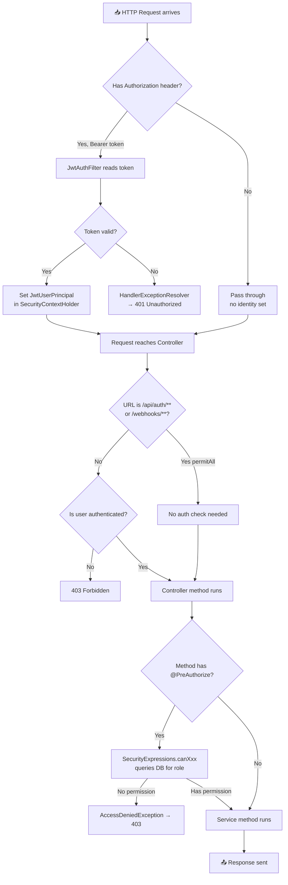
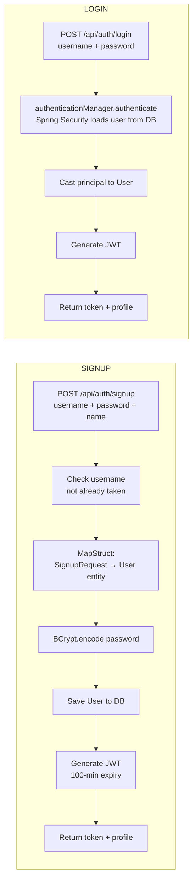
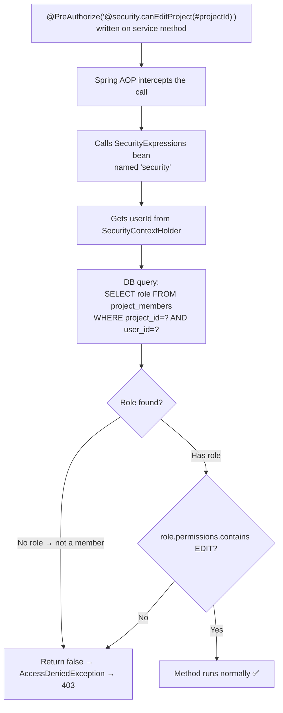
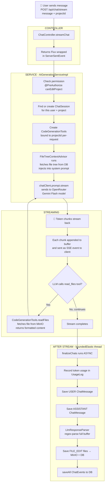
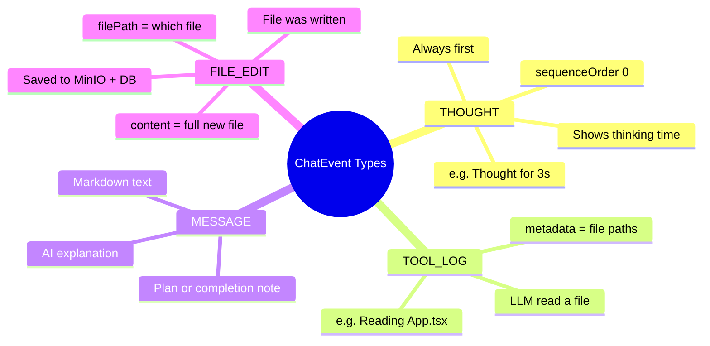
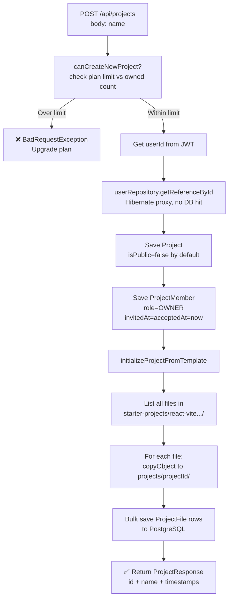
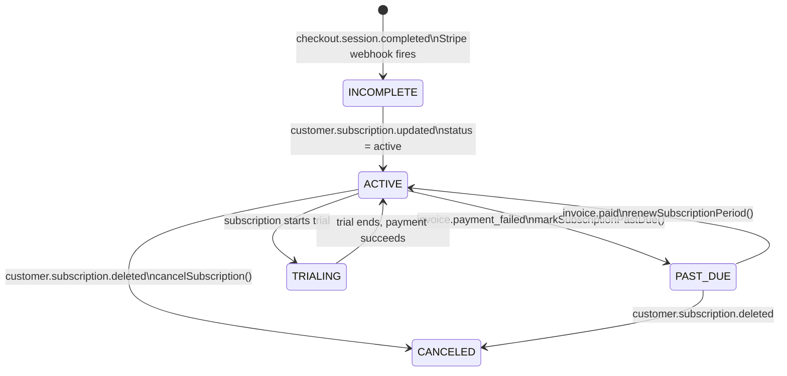
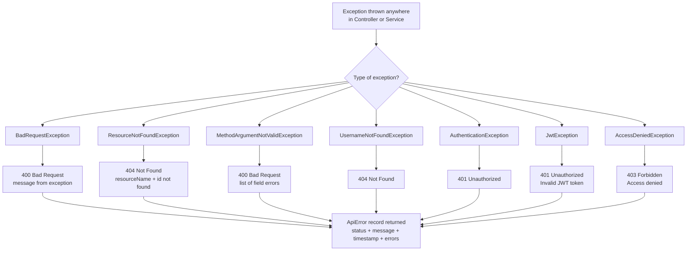
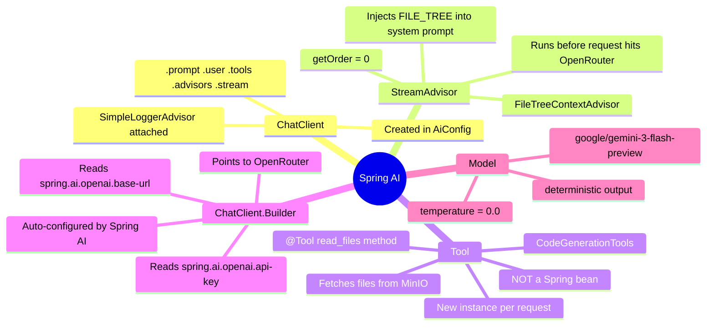
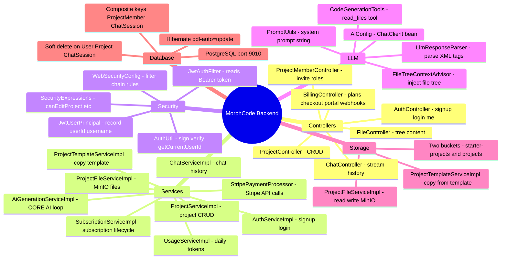

# MorphCode — Visual Memory Diagrams

> Layman-friendly diagrams to help you visualize and memorize how the backend works.
> These are not formal UML — just clear mental models.

---

## 1. The Big Picture — Every Layer at a Glance

```
┌─────────────────────────────────────────────────────┐
│                    CLIENT (Browser)                  │
│          HTTP Requests  /  SSE Stream                │
└───────────────────┬─────────────────────────────────┘
                    │
                    ▼
┌─────────────────────────────────────────────────────┐
│              SECURITY LAYER                         │
│    JwtAuthFilter  →  reads Bearer token             │
│    SecurityContextHolder  ←  stores identity        │
└───────────────────┬─────────────────────────────────┘
                    │
                    ▼
┌─────────────────────────────────────────────────────┐
│              CONTROLLERS  (port 8082)               │
│  AuthController  ChatController  ProjectController  │
│  FileController  BillingController  MemberController│
└───────────────────┬─────────────────────────────────┘
                    │
                    ▼
┌─────────────────────────────────────────────────────┐
│            SERVICE LAYER  (@PreAuthorize)           │
│  AuthService  ProjectService  ChatService           │
│  AiGenerationService  SubscriptionService           │
│  ProjectFileService  UsageService                   │
└──────────┬──────────────────────────┬───────────────┘
           │                          │
           ▼                          ▼
┌──────────────────┐      ┌───────────────────────────┐
│  REPOSITORIES    │      │   EXTERNAL SERVICES        │
│  Spring Data JPA │      │  OpenRouter (AI/LLM)       │
│  ↓               │      │  MinIO  (file storage)     │
│  PostgreSQL      │      │  Stripe (payments)         │
└──────────────────┘      └───────────────────────────┘
```

---

## 2. What Happens on Every HTTP Request



---

## 3. JWT Token — What's Inside and How It Works

```
┌──────────────────────────────────────────────────────────┐
│                    JWT TOKEN                             │
│                                                          │
│  HEADER.PAYLOAD.SIGNATURE                                │
│     ↓         ↓         ↓                               │
│  algorithm   data    HS256 signed with secret key        │
│                                                          │
│  PAYLOAD contains:                                       │
│  ┌─────────────────────────────┐                         │
│  │  sub     = "user@email.com" │  ← username            │
│  │  userId  = "42"             │  ← stored as String    │
│  │  iat     = 1717000000       │  ← issued at           │
│  │  exp     = 1717006000       │  ← expires in 100 min  │
│  └─────────────────────────────┘                         │
└──────────────────────────────────────────────────────────┘

How it flows:

 SIGNUP / LOGIN                    EVERY OTHER REQUEST
 ─────────────────                 ─────────────────────
 1. POST /api/auth/signup          1. Client sends:
 2. Server creates user               Authorization: Bearer eyJhbGci...
 3. Generates JWT token            2. JwtAuthFilter intercepts
 4. Returns: { token: "eyJ..." }   3. Verifies signature with secret key
 5. Client stores token            4. Extracts userId from claims
                                   5. Puts in SecurityContextHolder
                                   6. Service calls getCurrentUserId()
```

---

## 4. Signup and Login Flow



---

## 5. Who Can Do What — Role Permissions

```
OWNER  ──────────────────────────────────────────────────
  ✅ View files          ✅ Edit via AI
  ✅ Delete project      ✅ View members
  ✅ Manage members (invite / change role / remove)

EDITOR  ─────────────────────────────────────────────────
  ✅ View files          ✅ Edit via AI
  ❌ Delete project      ✅ View members
  ❌ Manage members

VIEWER  ─────────────────────────────────────────────────
  ✅ View files          ❌ Edit via AI
  ❌ Delete project      ✅ View members
  ❌ Manage members

PERMISSION → API GUARD
──────────────────────────────────────────────────────────
VIEW            → canViewProject()    → getUserProjectById()
EDIT            → canEditProject()    → updateProject(), streamResponse()
DELETE          → canDeleteProject()  → softDelete()
VIEW_MEMBERS    → canViewMembers()    → getProjectMembers()
MANAGE_MEMBERS  → canManageMembers()  → invite / update / remove
```

---

## 6. How @PreAuthorize Checks Permission



---

## 7. The Full AI Chat Stream — End to End



---

## 8. What finalizeChats Does — Step by Step

```
STREAM ENDS
     │
     ▼
① Record tokens used today
   UsageLog: userId + date → tokensUsed += N
   (one row per user per day, upsert pattern)

     │
     ▼
② Save USER message to DB
   ChatMessage { role=USER, content="user's text", tokensUsed=promptTokens }

     │
     ▼
③ Save ASSISTANT message to DB
   ChatMessage { role=ASSISTANT, content="hardcoded placeholder", tokensUsed=completionTokens }

     │
     ▼
④ Parse the full buffered LLM response with regex
   LlmResponseParser scans for:
   <message>...</message>   → MESSAGE event
   <file path="...">...</file>  → FILE_EDIT event
   <tool args="...">...</tool>  → TOOL_LOG event

     │
     ▼
⑤ Prepend THOUGHT event at sequenceOrder=0
   content = "Thought for 3s"  (time-to-first-token)

     │
     ▼
⑥ For every FILE_EDIT event:
   → Write file bytes to MinIO
   → Upsert ProjectFile row in PostgreSQL

     │
     ▼
⑦ saveAll ChatEvents to PostgreSQL
   (all at once, not one by one)
```

---

## 9. LLM Output XML Tags — What Each Tag Means

```
LLM RESPONSE (raw text stream):
─────────────────────────────────────────────────────
<message phase="start">
  I'll update App.tsx to add dark mode toggle.
</message>
          ↓ becomes ChatEvent { type=MESSAGE }

<tool args="src/App.tsx">
  Reading App.tsx...
</tool>
          ↓ becomes ChatEvent { type=TOOL_LOG, metadata="src/App.tsx" }
          ↓ ALSO triggers actual read_files() tool call to MinIO

<file path="src/App.tsx">
  import React, { useState } from 'react';
  ...full file content...
</file>
          ↓ becomes ChatEvent { type=FILE_EDIT, filePath="src/App.tsx" }
          ↓ ALSO triggers saveFile() to MinIO

<message phase="completed">
  Done! Added toggle to the navbar.
</message>
          ↓ becomes ChatEvent { type=MESSAGE }
─────────────────────────────────────────────────────

+ A THOUGHT event is always prepended at sequenceOrder=0
  ChatEvent { type=THOUGHT, content="Thought for 3s" }
```

---

## 10. ChatEvent Types — Visual Summary



---

## 11. MinIO Storage — Two Buckets

```
┌─────────────────────────────────────────────────────────┐
│  BUCKET: starter-projects  (read-only template)         │
│                                                          │
│  react-vite-tailwind-daisyui-starter/                   │
│  ├── index.html                                          │
│  ├── package.json                                        │
│  ├── vite.config.ts                                      │
│  ├── tailwind.config.js                                  │
│  └── src/                                               │
│      ├── App.tsx                                         │
│      ├── main.tsx                                        │
│      └── index.css                                       │
└──────────────────────┬──────────────────────────────────┘
                       │
           When user creates project → copyObject (server-side)
                       │
                       ▼
┌─────────────────────────────────────────────────────────┐
│  BUCKET: projects  (live user files)                    │
│                                                          │
│  {projectId}/                                            │
│  ├── 5/                  ← project ID = 5               │
│  │   ├── index.html                                      │
│  │   ├── src/App.tsx     ← key = "5/src/App.tsx"        │
│  │   └── src/main.tsx                                    │
│  ├── 6/                  ← project ID = 6               │
│  │   └── ...                                             │
└─────────────────────────────────────────────────────────┘

READ  → uses hardcoded "projects" constant  ⚠️ (bug)
WRITE → uses @Value("${minio.project-bucket}")
```

---

## 12. Project Creation — Every Step Visualized



---

## 13. FileTreeContextAdvisor — What It Does Before Every AI Call

```
EVERY TIME user sends a message to the AI:

WITHOUT advisor:
  System Prompt + User Message → sent to OpenRouter

WITH FileTreeContextAdvisor:
  System Prompt
       +
  ---- FILE_TREE ----         ← injected by advisor
  [FileNode(path=src/App.tsx),
   FileNode(path=src/main.tsx),
   FileNode(path=index.html), ...]
       +
  User Message
       ↓
  sent to OpenRouter

So the LLM always knows WHAT FILES EXIST
before deciding which ones to read.

⚠️ Known issue: this does a DB query on EVERY LLM turn.
   No caching. Slow on large projects.
```

---

## 14. Subscription Lifecycle States



---

## 15. Stripe Webhook — 5 Events and What They Do

```
Stripe → POST /webhooks/payment
              │
              ▼
    Webhook.constructEvent()
    verifies Stripe-Signature header
              │
    ┌─────────┴──────────────────────────────┐
    │  Switch on event.getType()              │
    └────────────────────────────────────────┘
              │
    ┌─────────┬────────────┬────────────┬──────────────┬───────────────┐
    │         │            │            │              │               │
    ▼         ▼            ▼            ▼              ▼               ▼
checkout. customer.   customer.    invoice.       invoice.
session.  subscription. subscription. paid       payment_failed
completed updated      deleted
    │         │            │            │              │
    ▼         ▼            ▼            ▼              ▼
 Create    Update        Set         Renew period   Set status
Subscript  status/plan  CANCELED    Set ACTIVE      PAST_DUE
  in DB    period dates   in DB     if was PAST_DUE  in DB
 Store
customer
  ID on
  User
```

---

## 16. Spring Security Filter Chain — Request Journey

```
Incoming HTTP Request
        │
        ▼
┌────────────────────────┐
│   JwtAuthFilter        │  ← runs FIRST (added before UsernamePasswordAuthFilter)
│                        │
│  1. Read Authorization │
│     header             │
│  2. Extract JWT token  │
│  3. Verify signature   │
│  4. Set principal in   │
│     SecurityContext    │
└──────────┬─────────────┘
           │
           ▼
┌────────────────────────┐
│  authorizeHttpRequests │
│                        │
│  /api/auth/**  →  ✅   │  ← permitAll, no login needed
│  /webhooks/**  →  ✅   │  ← permitAll, Stripe can call
│  ASYNC dispatch → ✅   │  ← needed for SSE streams
│  ERROR dispatch → ✅   │  ← needed for /error endpoint
│  everything else → 🔒 │  ← must be authenticated
└──────────┬─────────────┘
           │
           ▼
┌────────────────────────┐
│   Controller method    │
└──────────┬─────────────┘
           │
           ▼
┌────────────────────────┐
│  @PreAuthorize AOP     │  ← method-level check
│  queries project_members│
│  table for user's role  │
└────────────────────────┘
```

---

## 17. MapStruct — How DTO ↔ Entity Conversion Works

```
REQUEST COMES IN:
  JSON body → Spring deserialises → DTO (Java record)
                                        │
                              MapStruct.toEntity()
                                        │
                                        ▼
                                  JPA Entity
                                        │
                               repository.save()
                                        │
                                        ▼
                                   Saved in DB

RESPONSE GOES OUT:
  JPA Entity
      │
  MapStruct.toResponseDto()
      │
      ▼
  Response DTO (record)
      │
  Jackson serialises to JSON
      │
      ▼
  HTTP Response body

MAPPERS IN THIS PROJECT:
  SignupRequest  ──────────→  User entity         (UserMapper)
  User entity    ──────────→  UserProfileResponse (UserMapper)
  Project        ──────────→  ProjectResponse     (ProjectMapper)
  Project+Role   ──────────→  ProjectSummaryResp  (ProjectMapper)
  ProjectMember  ──────────→  MemberResponse      (ProjectMemberMapper)
  ChatMessage[]  ──────────→  ChatResponse[]      (ChatMapper)
  Subscription   ──────────→  SubscriptionResp    (SubscriptionMapper)

⚡ MapStruct generates ALL this code at compile time.
   Zero reflection at runtime. Very fast.
```

---

## 18. Error Handling Flow



---

## 19. Soft Delete — How It Works Here

```
NORMAL DELETE:
  DELETE FROM projects WHERE id = 5
  → Row is GONE forever ❌

SOFT DELETE (used in MorphCode):
  UPDATE projects SET deleted_at = NOW() WHERE id = 5
  → Row STAYS in DB ✅ just marked as deleted

READING DATA:
  All queries manually filter: WHERE deleted_at IS NULL

  Example:
  SELECT * FROM projects
  WHERE pm.user_id = 10
    AND p.deleted_at IS NULL   ← this line excludes deleted
  ORDER BY updated_at DESC

ENTITIES WITH SOFT DELETE:
  User       → deletedAt field
  Project    → deletedAt field
  ChatSession → deletedAt field

NOTE: MorphCode does NOT use Hibernate's @Where annotation
      Every repository query manually adds the IS NULL check
      This means you CAN accidentally forget to filter!
```

---

## 20. Composite Keys — ProjectMember and ChatSession

```
WHY COMPOSITE KEY?
  A user can be a member of MANY projects.
  A project can have MANY members.
  The COMBINATION of (project_id + user_id) is unique.
  No need for a separate auto-generated ID.

ProjectMember table:
┌─────────────┬─────────┬──────────────┬────────────┐
│ project_id  │ user_id │ project_role │ invited_at │
│ (PK part 1) │(PK part2│              │            │
├─────────────┼─────────┼──────────────┼────────────┤
│      5      │   10    │    OWNER     │ 2026-01-01 │
│      5      │   20    │    EDITOR    │ 2026-01-02 │
│      6      │   10    │    VIEWER    │ 2026-01-03 │
└─────────────┴─────────┴──────────────┴────────────┘
  ↑ User 10 is OWNER of project 5 but VIEWER of project 6

In Java:
  @Embeddable  ← marks it as embeddable key
  class ProjectMemberId {
      Long projectId;
      Long userId;
  }

  @Entity
  class ProjectMember {
      @EmbeddedId ProjectMemberId id;
      @MapsId("projectId") Project project;  ← links FK
      @MapsId("userId") User user;           ← links FK
  }

⚠️ ChatSessionId is missing @Embeddable — this is a known bug.
```

---

## 21. UsageLog — Daily Token Tracking

```
One row per user per day:
┌─────────┬────────────┬─────────────┐
│ user_id │    date    │ tokens_used │
├─────────┼────────────┼─────────────┤
│   10    │ 2026-06-01 │    4500     │
│   10    │ 2026-06-02 │    1200     │
│   20    │ 2026-06-01 │    800      │
└─────────┴────────────┴─────────────┘
  ↑ UNIQUE constraint on (user_id, date)

UPSERT PATTERN:
  findByUserIdAndDate(userId, today)
      │
      ├── Found? → add tokens to existing row
      │
      └── Not found? → create new row with tokensUsed=0
                       then add tokens

LIMIT CHECK (currently commented out):
  if currentUsage >= plan.maxTokensPerDay()
      → throw 429 Too Many Requests
  if plan.unlimitedAi == true
      → skip the check entirely
```

---

## 22. Spring AI Components — How They Connect



---

## 23. The getReferenceById vs findById Decision

```
findById(userId)          getReferenceById(userId)
─────────────────         ────────────────────────
SELECT * FROM users       NO SQL query executed
WHERE id = 42             Returns a Hibernate PROXY
                          (a fake object with just the ID)
Returns real User obj
                          Used when you only need the
Used when you need        object as a FOREIGN KEY
to read its fields        e.g. setting project.user = proxy
                          Hibernate fills in the FK column
                          without needing the full row

MorphCode uses getReferenceById() in createProject()
to avoid an extra SELECT when just setting the OWNER FK.
```

---

## 24. Full Component Mind Map



---

## 25. Known Bugs — Quick Reference Card

```
╔══════════════════════════════════════════════════════════╗
║              ⚠️  KNOWN BUGS TO REMEMBER  ⚠️              ║
╠══════════════════════════════════════════════════════════╣
║ 1. GET /api/auth/me                                      ║
║    hardcodes userId = 1L  (ignores your token)           ║
╠══════════════════════════════════════════════════════════╣
║ 2. GET /api/plans                                        ║
║    always returns []  (repo never called)                ║
╠══════════════════════════════════════════════════════════╣
║ 3. ChatSessionId missing @Embeddable                     ║
║    Hibernate mapping is technically undefined            ║
╠══════════════════════════════════════════════════════════╣
║ 4. ProjectFileServiceImpl bucket mismatch                ║
║    reads  → hardcoded "projects"                         ║
║    writes → @Value("${minio.project-bucket}")            ║
╠══════════════════════════════════════════════════════════╣
║ 5. Daily token limit COMMENTED OUT                       ║
║    usageService.checkDailyTokensUsage() not called       ║
╠══════════════════════════════════════════════════════════╣
║ 6. ASSISTANT ChatMessage.content hardcoded               ║
║    content = "Assistant Message here..."                 ║
║    Real content lives in ChatEvent records               ║
╠══════════════════════════════════════════════════════════╣
║ 7. Preview entity has no @Entity annotation              ║
║    No repository. Feature not implemented.               ║
╠══════════════════════════════════════════════════════════╣
║ 8. FileTreeContextAdvisor hits DB every LLM call         ║
║    No caching. N queries per stream on large projects.   ║
╠══════════════════════════════════════════════════════════╣
║ 9. Mixed @Transactional imports                          ║
║    ProjectServiceImpl  → org.springframework             ║
║    ProjectMemberServiceImpl → jakarta                    ║
╚══════════════════════════════════════════════════════════╝
```
